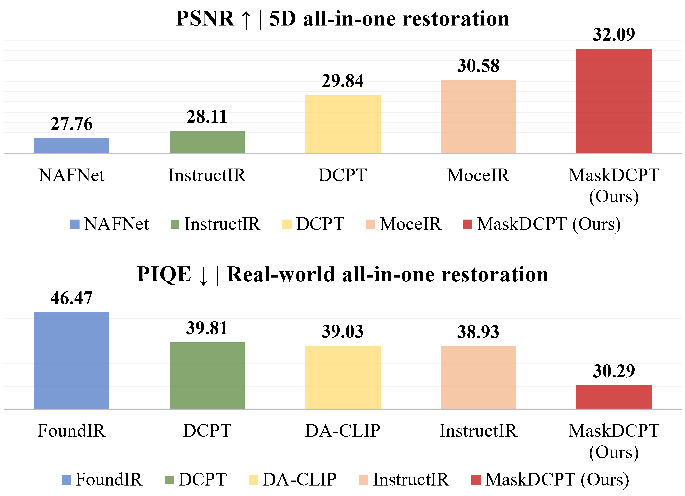
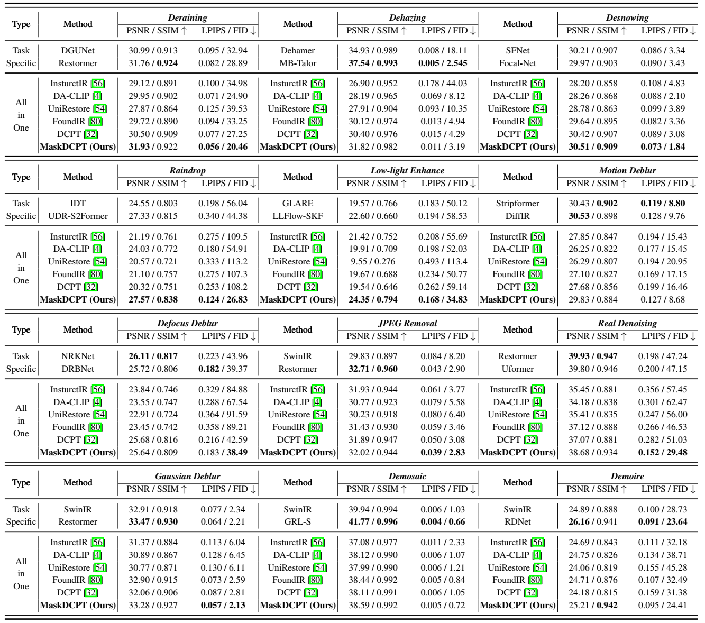

# Universal Image Restoration Pre-training via Masked Degradation Classification

[JiaKui Hu](https://scholar.google.com/citations?user=VagFt-sAAAAJ), [Zhengjian Yao](https://scholar.google.com/citations?user=D8rEFlEAAAAJ), [Lujia Jin](https://scholar.google.com/citations?user=-BWasB8AAAAJ), [Yinghao Chen](), [Yanye Lu](https://scholar.google.com/citations?user=WSFToOMAAAAJ)*

MILab, Peking University

---

🚀️🚀️ **News:**

- 2025-10-15: Release the inference scripts and pre-trained models of MaskDCPT.

**TODO-lists:**

- [ ] Release the train scripts.

## Abstract

This study introduces a **Masked Degradation Classification Pre-Training method (*MaskDCPT*)**, designed to facilitate the classification of degradation types in input images, leading to comprehensive image restoration pre-training. Unlike conventional pre-training methods, MaskDCPT uses the degradation type of the image as an extremely weak supervision, while simultaneously leveraging the image reconstruction to enhance performance and robustness. MaskDCPT includes an encoder and two decoders: the encoder extracts features from the masked low-quality input image. The classification decoder uses these features to identify the degradation type, whereas the reconstruction decoder aims to reconstruct a corresponding high-quality image. This design allows the pre-training to benefit from both masked image modeling and contrastive learning, resulting in a generalized representation suited for restoration tasks. Benefit from the straightforward yet potent MaskDCPT, the pre-trained encoder can be used to address universal image restoration and achieve outstanding performance. Implementing MaskDCPT significantly improves performance for both convolution neural networks (CNNs) and Transformers, with a minimum **increase in PSNR of 3.77 dB** in the 5D all-in-one restoration task and a **34.8% reduction in PIQE** compared to baseline in real-world degradation scenarios. It also emergences strong generalization to previously unseen degradation types and levels. In addition, we curate and release the ***UIR-2.5M*** dataset, which includes **2.5 million paired** restoration samples across *19 degradation types and over 200 degradation levels*, incorporating both synthetic and real-world data.


## Results



<details>
<summary><strong>5D All-in-one Image Restoration</strong> (click to expand) </summary>


</details>

<details>
<summary><strong>12D All-in-one Image Restoration</strong> (click to expand) </summary>



</details>

<details>
<summary><strong>Out-of-distribution Image Restoration (Gaussian Denoising)</strong> (click to expand) </summary>


</details>

<details>
<summary><strong>Real-world All-in-one Image Restoration</strong> (click to expand) </summary>


</details>

<details>
<summary><strong>Mixed Degradation Image Restoration</strong> (click to expand) </summary>


</details>

## Quick Start

### Setup

Clone via Github:

```shell
git clone https://github.com/MILab-PKU/MaskDCPT.git
cd MaskDCPT
```

You can also create a new environment to avoid conflicts:

```
conda env create -f environment.yml
conda activate maskdcpt
```

> !!! Remove `basicsr` in your python environment !!!

### Test

Download [**pretrained models**](https://huggingface.co/Jiakui/MaskDCPT), and put them in `./pretrained_models`.

To reproduce the results in our paper, please modify the dataset path and model path, then run:

```shell
python basicsr/test.py -opt options/all_in_one/test/test_NAFNet_5d.yml
# you can modify the path of config file after `-opt`.
```

## UIR-2.5M Dataset

We collect and release the largest universal image restoration dataset.

- **2.5M** image pairs.
- **19** degradation types.
- **more than 200** degradation levels.


<details>
<summary><strong>Details about the UIR-2.5M Dataset.</strong> (click to expand) </summary>


</details>

> It will be uploaded on huggingface. Stay tuned.

---

If you find this repository useful, please consider giving a star ⭐.

For help or issues using this git, please submit a GitHub issue.

For other communications related to this git, please get in touch with `jkhu29@stu.pku.edu.cn`.
